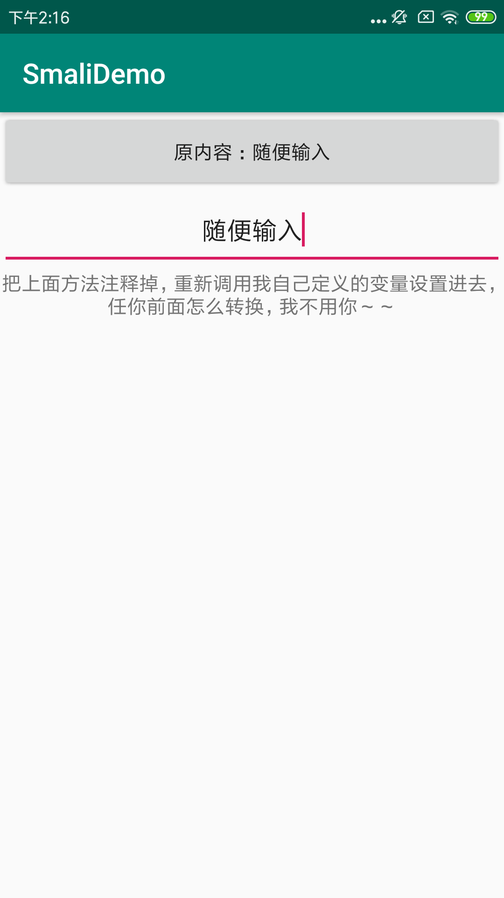

本工程目标——反编译本工程打包的apk，修改smali文件并重新打包，实现内部逻辑修改

**效果图**

  

[apk反编译后MainActivity.smali文件](reverse_code/smali/com/hd/smalidemo/MainActivity.smali)

[unicode与中文互转](http://tool.chinaz.com/tools/unicode.aspx)

[smali语法](../../smali.md)

**反编译apk**

```
apktool -r d apk-path -o output-path
```

**回编译apk**

```
apktool b output-path
```

**命令行打包指令**

```
jarsigner -verbose -keystore [签名存放路径] -signedjar [签名后的apk文件名] [未签名的apk文件名] [证书别名]
```
