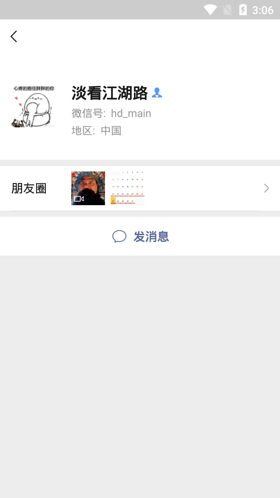

**本工程目标——获取某个微信联系人信息**



**本工程侧重逆向思路分析，基于[微信7.0.4版本源码](./docs/weixin_7.0.4_source)**

**思路分析**

1. 联系人信息界面activityC肯定是需要从联系人列表点击进入的，activityC有两种方式来得到个人信息并显示：a.通过intent的方式，由前一个界面传递该用户所有信息过去，b.通过intent传递部分信息，比如id，然后再联网或者从本地数据库获取其他信息。

2. 从一个实际体验的效果来看，联网获取肯定是不太合理的，那边现在优先考虑intent方式传递全部数据；

3. 微信打开activityC然后通过adb指令 **adb shell dumpsys activity | grep "mFocusedActivity"** , 我们可以查看到activityC类名为: **com.tencent.mm..plugin.profile.ui.ContactInfoUI**, 即 **activityC == ContactInfoUI**；

4. 拿到目标类ContactInfoUI，接下来开始写代码验证intent

```
  private void handleContactInfo(final XC_LoadPackage.LoadPackageParam lpparam) {
        XposedHelpers.findAndHookMethod(weixinContactInfoClassName, lpparam.classLoader,
                "onCreate",Bundle.class, new XC_MethodHook() {
                    @Override
                    protected void beforeHookedMethod(MethodHookParam param) throws Throwable {
                        super.beforeHookedMethod(param);
                        Log.i(TAG, "打印 handleContactInfo beforeHookedMethod：" + param.method);
                    }

                    @RequiresApi(api = Build.VERSION_CODES.KITKAT)
                    @Override
                    protected void afterHookedMethod(MethodHookParam param) throws Throwable {
                        super.afterHookedMethod(param);
                        Activity activity = (Activity) param.thisObject;
                        Intent intent = activity.getIntent();
                        Set<String> keys = Objects.requireNonNull(intent.getExtras()).keySet();
                        for (String string : keys) {
                            Log.i(TAG, "打印 handleContactInfo keys 内容 ：" + string);
                        }
                    }
                });
    }
```

5. 我们拿到了从上一个界面传递过来的intent并做了一个遍历，结果可以看到intent传递过来的数据是极其有限的，所以a方式基本可以被排除；

```
   //intent传递的key只打印了以下三个字段：
   //Contact_Mobile_MD5  
   //Contact_User  
   //CONTACT_INFO_UI_SOURCE  
```

6. 到此我们基本可以判断ContactInfoUI界面的数据是通过intent传递过来的某一数据（这里指Contact_User）作为查询条件从本地数据库获取而来；

7. 接下来从代码部分进一步验证，jadx搜索ContactInfoUI，在onCreate方法内部可以看到比较关键的一句话；

```
ad aoO = com.tencent.mm.model.c.XM().aoO(bo.nullAsNil(getIntent().getStringExtra("Contact_User")));
```

8. 跟踪到ad类，可以搜索到一些比较关键性的字： Cursor， 至此可以肯定数据是以Contact_User值为条件从数据库查询而来；

9. 剩下的操作就是操作微信数据库，本工程作为基础部分，不在进行后续操作了；


